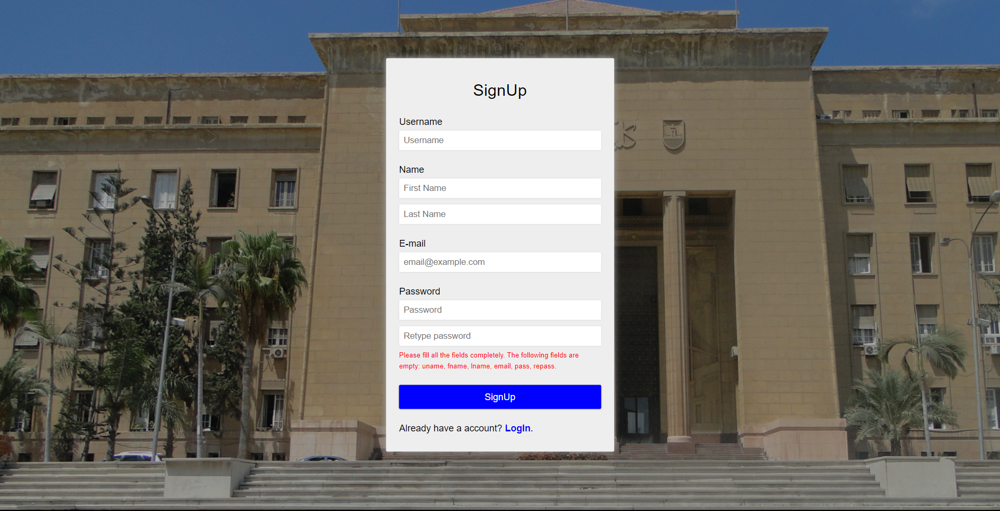

# Signup and login pages
This repository contains signup and login pages in **PHP** which use **MySQL** database.


## Setup
To use this, copy contents of **src** folder to your web server root (assuming you have **LAMP**, **WAMP** or **MAMP** setup. if not, do it first.)

You have to create a MySQL user named *'user'* and password *'password'* (which you can change in php files in **src**)

To do this, run mysql server in a command line shell and enter following **SQL**:

```sql
CREATE USER 'user'@'localhost' IDENTIFIED BY 'password';
```
```sql
GRANT ALL PRIVILEGES ON *.* TO 'user'@'localhost';
```
```sql
FLUSH PRIVILEGES;
```

You also have to create a database named login and a table named list by entering following **SQL** commands:

```sql
CREATE DATABASE login;
```
```sql
USE login;
```
```sql
CREATE TABLE list (
    id int not null auto_increment,
    user_name varchar(255) not null,
    first_name varchar(255) not null,
    last_name varchar(255) not null,
    email varchar(255) not null,
    password varchar(255) not null,
    PRIMARY KEY (id)
);
```

## About
The directory **src** contains 3 PHP files:
* signup.php
* login.php
* success.php

**signup.php** returns a **html** form to user and on submit, validates it using regular expressions. It then connects to **mysql** server and checks for duplicate username or email and finally inserts entry for new user in database, starts a new session by initializing session variables and takes to **success.php**.

**login php** returns a form to client and on submitting, fetches data from database by username and compares passwords and if passwords match, starts a new session and takes to  **success.php**.

**success.php** greets user and retains user session started in **signup.php** or **login.php**. If user clicks logout, current session is destroyed and user is taken to **login.php**. If session variables are not set or username in session variables is not in database or password doesn't match, this page redirects to **login.php** and so, this page can't be accessed without logging in with valid details.

Also, these scripts use prepared SQL statements preventing SQL injection. The **HTML** forms in these pages also contain some basic **CSS** style.


## Screenshots
Following are few screenshots of these pages.




___
The code is not clean, but good enough (I guess). :stuck_out_tongue_closed_eyes:

You can add it to your server or website, and do anything you want, like improve style or appearance, improve code add new features etc. :+1:

Thanks ~ @deadfrominside :smile:
